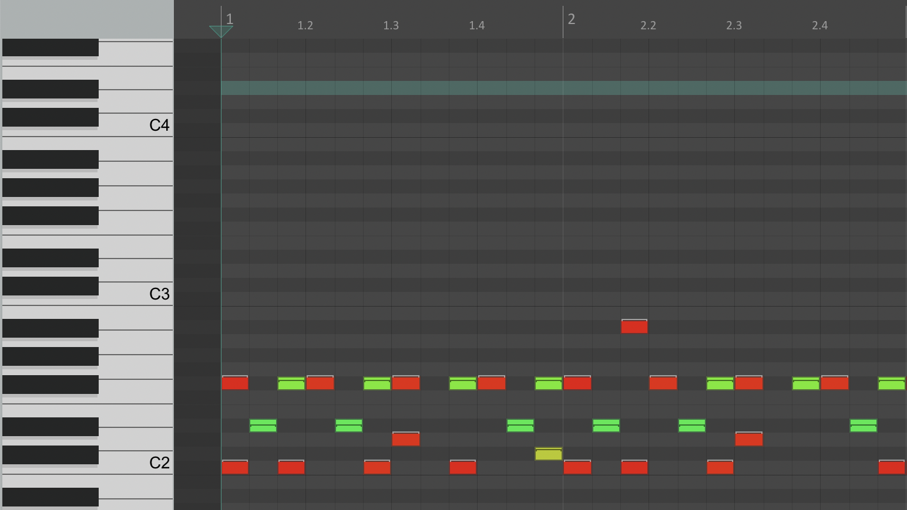

# Looping with Variations

I use [Reaper](https://reaper.fm/) Digital Audio Workstation (DAW) for recording and sequencing music. A common feature for DAWs is to enable simple sequencing of a synthesizer instrument by filling in a grid [Piano Roll](https://en.wikipedia.org/wiki/Piano_roll) to program which notes should be played on which beat.

Piano Roll interfaces demonstrate an application of **"Match[ing] between system and the real world"**, a [usability guideline for using concepts in the real world](https://www.nngroup.com/articles/ten-usability-heuristics/) to help make user interfaces familiar and **learnable**. The piano roll interface originates from the design of player pianos, which used a roll of paper with punched notes that instructed the piano to play notes at a particular time. Here you can see a player piano roll ([courtesy of Draconichiaro on wikipedia](https://en.wikipedia.org/wiki/Player_piano)):

In DAWS, it is common to rotate that orientation so that time (or *measures* in music) is represented horizontally, left-to-right. Here, you can see how Reaper's piano roll interface looks, where the rows correspond with the notes on the standard piano keyboard (shown on the left) and columns correspond with the beats and measures in the song:

When sequencing sythesizer instruments, and especially drum beats, it is common to want to repeat *most* of a sequence but with some minor variation to keep things interesting. As I am familiar with duplicating things (words in a document, numbers in a spreadsheet, etc.) I expect to be able to identify an area to copy and then paste in another place to duplicate it. Copying and pasting has common **conventions** that most software uses, including shortcuts like *holding shift while selecting the beginning and end of an area to select everything between*, *using command/control-C to copy*, and *using command/control-V to paste*. Since it is common across most applications, I expected it to work similarly in Repear's piano roll. However, the following animation shows my first interaction in trying to copy a segment of notes into the empty space (of same duration) after it:

As shown in the animation, the selection considers both the vertical placement of the note *in addition to* to horizontal representation of the time it should be played. This surprised me since I expected selection with the shift button to identify all notes between those moments in time in the song, regardless of how high/low the note is. Getting all of the notes requires the additional step of selecting each remaining note (while continuing to hold down *shift*). I was able to **recover from the error**, but it is inconvenient to have to make additional actions since every time I want to copy-and-paste a segment of music, I want to select those notes based on a time period alone. 

The problem becomes increasingly frustrating when there are many notes higher or lower than the range of first-to-last notes. I would suggest a reasonable solution to simply ignore the note's pitch when selecting a sequence of notes; instead, it should only consider the *order* of notes and anything in between the first-and-last note clicked (inclusive of notes placed at the same time as either the first or last) should be included in the selection.

